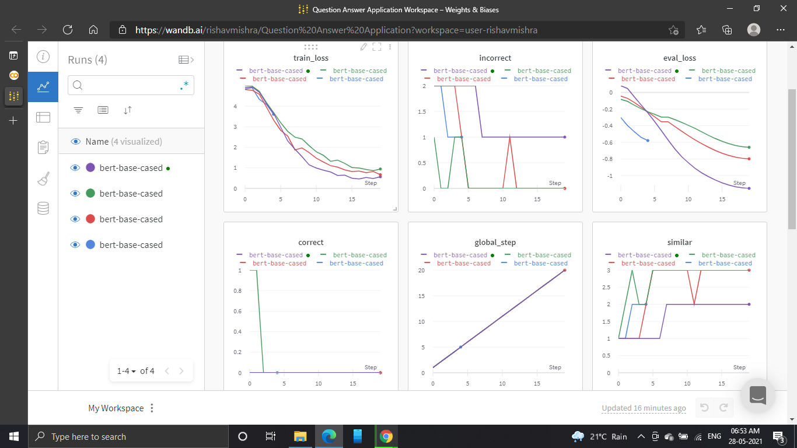

<h1>DistilBert_QuestionAnswer_Model</h1>

<h2>The DistilBert Question and Answer Model is generally based on the library simpletransformers which is specially made for all types of distilbert.</h2>

<h3>In this DistilBert model the Question and Answer Sequence is like :- </h3>
  
  
  
<h3>After all this question and answer sequences we were looking into the visuallization part of the training and testing of the model which looks like this</h3>
  

<h3>After all this model visuallization we got into the uses of the gpu system uses and other details which were like :- </h3>
  

Using wandb.ai library
